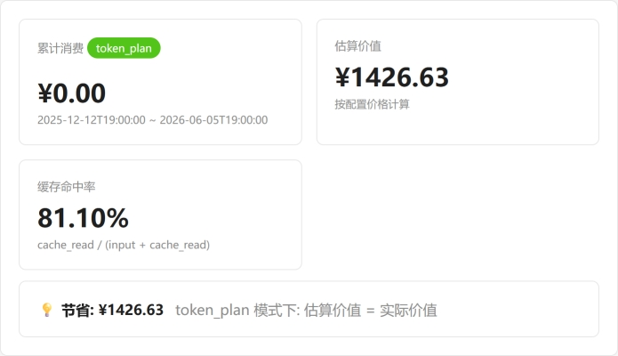
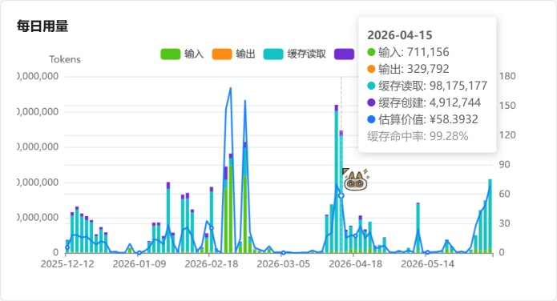
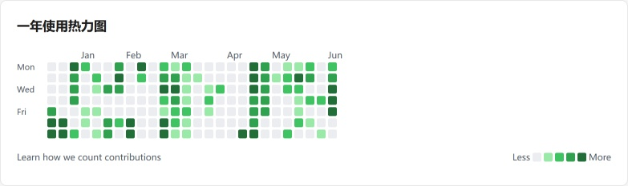
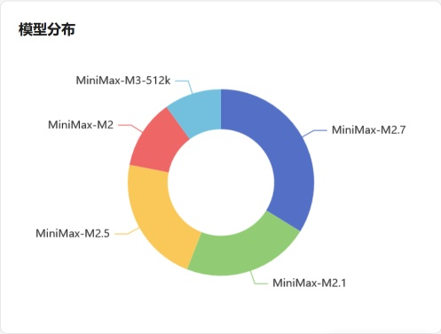

# MiniMax 用量看板

[](LICENSE)

本地 Web 看板，把 MiniMax 平台导出的 CSV 用量明细做可视化，支持按量计费 / Token 套餐两种模式。

## 预览

### 金额与每日用量

<table>
  <tr>
    <td width="50%" align="center">
      
      <br><b>三大金额卡 + 节省</b>
      <br><sub>累计消费 / 估算价值 / 缓存命中率</sub>
    </td>
    <td width="50%" align="center">
      
      <br><b>每日用量 4 系列堆叠柱</b>
      <br><sub>输入/输出/缓存读/缓存创建 + 估算价值折线</sub>
    </td>
  </tr>
</table>

### 热力图

<table>
  <tr>
    <td width="50%" align="center">
      
      <br><b>7×24 周内热力图</b>
      <br><sub>按星期 × 小时看活动强度</sub>
    </td>
    <td width="50%" align="center">
      
      <br><b>一年使用热力图（GitHub 风格）</b>
      <br><sub>52 周 × 7 天，5 级绿色调，主题自动适配</sub>
    </td>
  </tr>
</table>

### 模型分布

<p align="center">
  
  <br><b>模型分布</b>
</p>


## 特性

- **拖拽导入** MiniMax 导出的 CSV，自动去重（按 11 字段唯一键）
- **三种金额卡**：累计消费、估算价值、**缓存命中率**
- **每日用量图**：输入 / 输出 / 缓存读 / 缓存创建 4 系列堆叠柱 + 估算价值折线 + 当日命中率
- **GitHub 风格年热力图**：52 周 × 7 天，5 级绿色调，主题自动适配（浅/深）
- **7×24 周内热力图**：每周每时的使用强度
- **模型/接口分布**：模型饼图只显示 LLM 模型，过滤按次计费
- **看板自定义布局**：拖拽顺序、显隐任意块，保存到库
- **浅色 / 深色 / 跟随系统**主题
- **单文件 SQLite**，无需安装数据库
- **用 `uv` 管理环境**，不污染全局 Python
- **?debug=1** 导入时返回错误详情（调试用）

## 环境要求

- Python 3.10+
- [uv](https://github.com/astral-sh/uv)

## 启动

### Windows（双击）

双击 `start.bat`

### 命令行

```bash
uv sync
uv run uvicorn app.main:app --port 8765
```

打开 http://localhost:8765

## 使用流程

1. 打开 [MiniMax 平台](https://platform.minimaxi.com/console/consumption-detail?tab=api-keys)，导出 CSV（最多 3 个月）
2. 打开 http://localhost:8765/settings
3. 拖入 CSV → 看到 `新增 / 跳过 / 错误` 计数
4. 点 **"从数据中拉取模型"** → 价格表自动列出所有模型
5. 填入价格（**元 / 百万 tokens**，按次模型填 **元 / 次**）
6. 打开 http://localhost:8765/dashboard 查看图表
7. （可选）点 **"✏️ 自定义布局"** 重排/隐藏板块

## 计费模式

在设置页切换，三种模式：

| 模式 | 说明 | 显示"节省" |
|------|------|-------------|
| **auto** | 数据全 0 → token_plan，否则 → pay_as_you_go | 视结果 |
| **pay_as_you_go** | 用 CSV 实际消费金额 | 否 |
| **token_plan** | 用配置价格估算价值 | 估算价值 |

## 价格配置

按 model 一行，每个模型 5 个字段。计算时按 endpoint 类型自动选择对应字段：

| 字段 | 单位 | 适用 endpoint |
|------|------|---------------|
| **输入价格** | 元 / 百万 tokens | `chatcompletion-v2` 的 input |
| **输出价格** | 元 / 百万 tokens | `chatcompletion-v2` 的 output |
| **缓存读取** | 元 / 百万 tokens | `cache-read` |
| **缓存写入** | 元 / 百万 tokens | `cache-create` |
| **按次价格** | 元 / 次 | 其他（`code_plan_resource_package`、`generate_lyrics`、`image-generation`、`t2a-v2` 等） |

按次计费场景下 `input_tokens` 字段表示调用次数。

## 数据存储

- 数据库：`data/usage.db`（SQLite，自动创建）
- 建议定期备份此文件

## 多次导入

MiniMax 单次最多导出 3 个月。每月导出一次，看板会自动合并去重（按 11 字段唯一键），可长期累积。

## 调试

导入报错时，在 URL 上加 `?debug=1` 即可拿到错误详情（行号、原因、原始数据）：

```bash
curl 'http://localhost:8765/api/import?debug=1' -F 'file=@bad.csv'
```

错误也会打到 server stderr（带 `[IMPORT]` 前缀）。

## 测试

```bash
uv run pytest -v
```

49 个测试覆盖：
- DB schema 与迁移
- CSV 解析 + 时间桶（含 23:00-24:00 跨日）
- 批量导入 + 去重
- 价格 CRUD + auto 模式判定 + 估算公式
- per-call 按次计费
- 看板聚合 SQL（4 类拆分 + 缓存命中率）
- 一年热力图（周列布局）
- 所有 API 端点
- 看板布局持久化

## API

| Method | Path | 用途 |
|--------|------|------|
| GET | `/api/dashboard` | 看板所有数据（一次返回） |
| GET | `/api/records` | 原始数据分页 + 过滤 |
| POST | `/api/import` | 上传 CSV（支持 `?debug=1`） |
| GET / PUT | `/api/settings` | 通用设置（billing_mode, theme） |
| GET / PUT | `/api/pricing` | 模型价格表 |
| POST | `/api/pricing/sync` | 从数据中拉取 (model, endpoint) 组合 |
| GET / PUT | `/api/layout` | 看板布局（顺序 + 显隐） |
| GET | `/api/stats` | 数据概览 |
| GET | `/api/import-history` | 导入历史 |
| POST | `/api/clear?confirm=yes` | 清空所有数据 |

## 目录结构

```
.
├── LICENSE                       # MIT
├── README.md
├── pyproject.toml
├── start.bat
├── screenshots/                  # README 用截图
├── data/usage.db                 # 运行时生成
├── exports/                      # 备用 CSV 目录
├── app/
│   ├── main.py                   # FastAPI 入口 + lifespan
│   ├── config.py
│   ├── db.py                     # SQLite schema + 迁移
│   ├── parser.py                 # CSV 解析 + 时间桶
│   ├── routes/api.py             # 所有 JSON 端点
│   ├── services/
│   │   ├── importer.py           # 批量写入 + 去重
│   │   ├── billing.py            # 价格 + auto + 估算
│   │   └── analytics.py          # 看板聚合 + 周列热力图
│   ├── templates/                # base + dashboard + settings
│   └── static/                   # base.css + theme.js + dashboard.js + settings.js + import.js
├── tests/                        # 49 个 pytest 测试
└── docs/superpowers/
    ├── specs/                    # 设计文档
    └── plans/                    # 实现计划
```

## 限制

- 仅支持 MiniMax 平台导出的 CSV 格式（11 列、UTF-8/GBK）
- 单次 CSV 上限 50 MB
- 只做本地单用户使用，无登录、无远程访问控制
- 模型分布饼图**只显示 LLM 模型**（按次计费的图像/音乐/歌词模型不过滤进饼图但仍可在接口分布查看）

## 许可

[MIT](./LICENSE) © 2026 The minimax-usage-dashboard contributors
